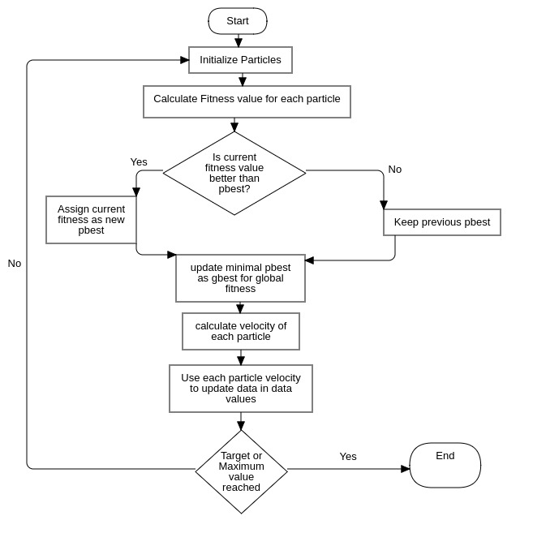

## An efficient approach to find the optimal network route using Swarm Intelligence.

Using the Particle Swarm Intelligence algorithm to manage dynamic nature of network routing.

## Abstract

In today’s world, fast and efficient communication on network between the sender and receiver is very important. For this communication, data is converted into packets and sent over the network using routing algorithms. In a network or over multiple networks, routing refers to the process of determining a path for a packet to travel from. The traditional algorithms used in networking for finding the minimum spanning tree and shortest path include Prim’s algorithm and Kruskal’s Algorithm. These methods solve the problem of traffic in networking in the narrow investigation of search space and hence result in inferior solutions. In this project, we aim to propose the basic idea of optimizing network routing using swarm intelligence. Particle swarm intelligence is a technique that utilizes the behavior of self-organizing, decentralized systems. It is considered to be a very optimum global search algorithm.

*Keywords*: _Network Routing, Optimization, Swarm Intelligence, PSO Algorithm, Minimum Spanning Tree_

## Aim
This project aims to compare and summarize the computer network routing strategies while investigating the optimization of these using *PSO technique*. The project focuses on minimal spanning tree and solves the shortest path problem using swarm intelligence. Particle Swarm Intelligence utilizes the combination of the behavior of swarms which is considered efficient for optimization and discrete multidimensional problems. 

## Particle Swarm Optimization
In Particle Swarm Optimization Algorithm, a subset of Swarm Intelligence, we optimize network routing by modifying traditional graph algorithms like Minimum Spanning trees by Kruskal’s or Prim’s methods by using cognitive intelligence algorithm to get better optimization and solve MDR(Multi Destination Routing) problem which cannot be solved effectively using traditional methods.

Particle Swarm Optimization algorithm implementation on network routing gives fast convergence speed, has an easy implementation, is cognitive and supports dynamic traffic.

## PSO Algorithm

## Contributors:

1. [Nishkarsh Raj](https://www.github.com/NishkarshRaj)
2. [Priyanka Yadav](https://www.github.com/Priyanka488)
3. [Harsh Joshi](https://www.github.com/josharsh)
4. [Lakshika Parihar](https://www.github.com/lakshika1064)

## How to Contribute:

[Contribution Guideline](CONTRIBUTING.md)

## License: 

Authorized [MIT](LICENSE) License 
