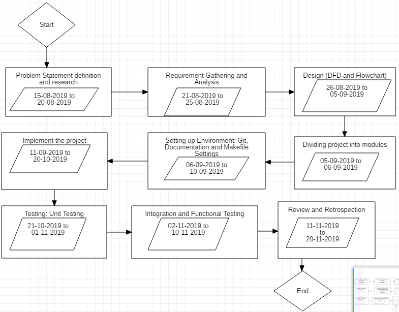

# Minor Project I
# An efficient approach to find the optimal network route using Swarm Intelligence.

# Project SDLC Model => Iterative Enhancement Model

We use Iterative enhancement model by creating a product backlog and dividing the whole project into sub modules which will be developed by all members in a distributed development environment using Git VCS.

# Members:

1. Documentation Head: [Harsh Joshi](https://www.github.com/josharsh)
2. Design Head: [Priyanka Yadav](https://www.github.com/Priyanka488)
3. Implementation Head: [Nishkarsh Raj](https://www.github.com/NishkarshRaj)
4. Testing Head: [Lakshika Parihar](https://www.github.com/lakshika1064)

# How to Collaborate:

1. Fork the repository to your own GitHub account.

2. Clone the repository to your local machine
```
$ git clone "https://www.github.com/{Username}/Minor-1-Swarm-Intelligence.git"
```
where username is your GitHub account username.

3. Create a branch where you can do your local work.
Never work on **master** branch as we do not allow master commits except by admins.
```
$ git branch {branchname}
$ git checkout branchname
```

4. Do your work and stage your changes.
```
$ git add <filename>
```

5. Commit you changes with a commit message containing your name, file(s) worked upon, changes added.
```
$ git commit -m "Name| files| Changes"
```

6. Push changes to your forked repository
```
$ git push -u origin branchname
```

# Synchronize forked repository with Upstream repository

1. Create upstream as our repository
```
$ git remote add upstream "https://www.github.com/NishkarshRaj/Minor-1-Swarm-Intelligence"
```

2. Fetch upstream changes in local machine
```
$ git fetch upstream
```

3. Switch to master branch
```
$ git checkout master
```

4. Merge changes in local machine
```
$ git merge upstream/master
```

5. Push changes to your forked GitHub repository
```
$ git push -f origin master
```

## Pert Chart



# License: 

Authorized [MIT](LICENSE) License 
